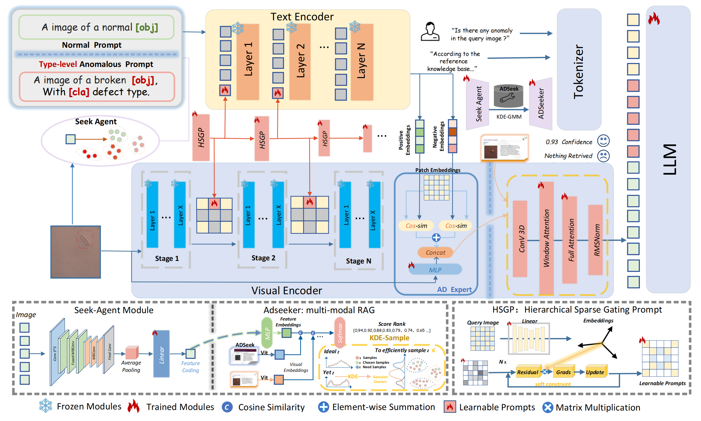

 

<h1 align="center"><strong>Seek4AD: A Knowledge-Infused Multimodal LLM Framework for
Generalized Cross-Domain Anomaly Detection </strong></h1>
  

	 
    
    
  

## 🏠 Introducing Seek4AD
<!--  -->

Seek4AD, a multi-modal anomaly task assistant which search the knowledge base under a certain domain through ADSeeker. The Seek-Agent RAG framework of ADSeeker is tailored for seeking knowledge across the first anomaly detection knowledge
base, ADSeek-Industry&Medical (ADSeek-I&M). To enhance the performance in Zero-Shot Anomaly Detection (ZSAD), Seek4AD leverages a Hierarchical Sparse Prompt (HSP) mechanism to efficiently extract the abnormal patterns from visual tokens. 
## 🔍 Model Architecture
<!--  -->

  

The architecture of Seek4AD. It consists of two main knowledge-infused pathways:(1)the query image is fed to the Seek-Agent and the mapping features extracted from linear layers are fed into ADSeeker to compute the similarity with visual embeddings of ADSeek to retrieve high-relevant domain knowledge.(2)The AD Expert integrates defect-region information involved in HSP and type-level features in learnable textual prompts as semantic-rich visual tokens which will be passed into LLM.

## 📝 TODO List
- \[x\] Release the Evaluation Metrics and Test Results.
- \[x\] Release the training and inference code.
- \[ \] Release the Checkpoint and Script.
- \[ \] Release Gradio Demo.
- \[ \] Release the MulA Dataset and the ADseeker I&M Knowledge Base.
